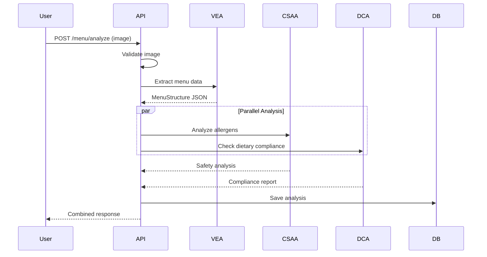
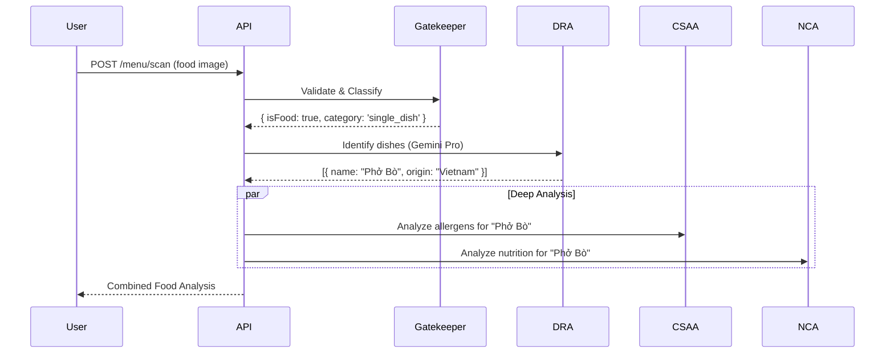
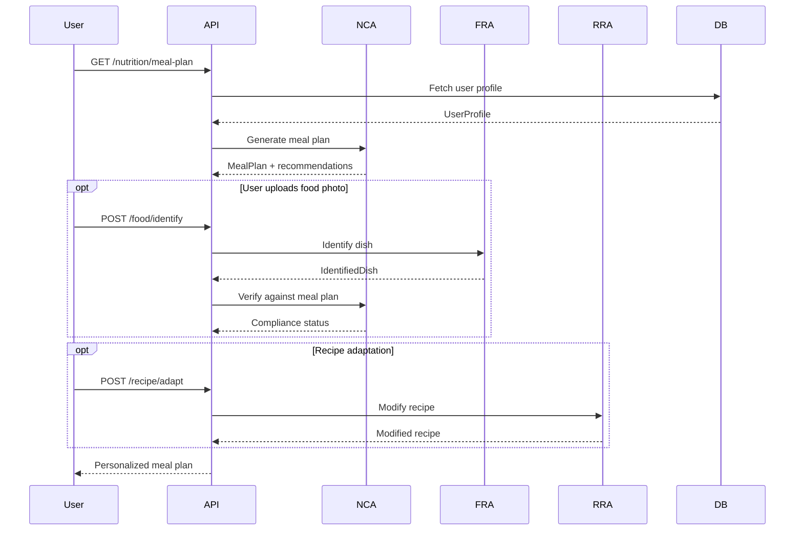
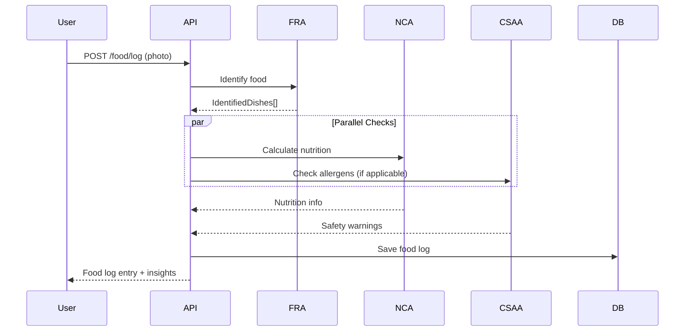

# TasteBuddyAI API - AI Angles/Agents System Design

**Version:** 1.0.0
**Date:** 2025-11-22
**Author:** Senior Backend Engineer & AI System Designer
**Status:** Design Document

---

## Table of Contents

1. [System Overview](#1-system-overview)
2. [AI Angles / Agents](#2-ai-angles--agents)
3. [Workflows & Task Design](#3-workflows--task-design)
4. [Architecture & SOLID Design](#4-architecture--solid-design)
5. [Testing Strategy](#5-testing-strategy)
6. [Senior Developer Checklist](#6-senior-developer-checklist)
7. [Backlog / Task List](#7-backlog--task-list)

---

## 1. System Overview

### 1.1 Executive Summary

TasteBuddyAI API is an intelligent food safety and nutrition analysis platform designed specifically for Vietnamese cuisine. The system leverages Google Gemini's multimodal AI capabilities to provide:

- **Menu Digitization**: OCR and structured data extraction from menu images
- **Allergen Safety Analysis**: Detection of hidden allergens in Vietnamese dishes
- **Nutrition Coaching**: Personalized nutrition recommendations and meal planning
- **Dietary Compliance**: Verification against dietary preferences and restrictions
- **Food Recognition**: Real-time food identification from images
- **Recipe Adaptation**: Recipe modification based on health conditions and preferences

### 1.2 Core Domains

Based on the config.angle.MD and project context, TasteBuddyAI API consists of these high-level domains:

```
┌─────────────────────────────────────────────────────────────┐
│                    TasteBuddyAI API                         │
├─────────────────────────────────────────────────────────────┤
│                                                             │
│  ┌──────────────┐  ┌──────────────┐  ┌──────────────┐    │
│  │   Menu       │  │  Allergen    │  │  Nutrition   │    │
│  │ Digitization │  │   Safety     │  │   Coaching   │    │
│  └──────────────┘  └──────────────┘  └──────────────┘    │
│                                                             │
│  ┌──────────────┐  ┌──────────────┐  ┌──────────────┐    │
│  │   Health     │  │    Food      │  │   Recipe     │    │
│  │   Profile    │  │ Recognition  │  │ Adaptation   │    │
│  └──────────────┘  └──────────────┘  └──────────────┘    │
│                                                             │
└─────────────────────────────────────────────────────────────┘
```

### 1.3 System Architecture

The system follows a **Multi-Agent Architecture** where specialized AI agents collaborate to solve domain-specific problems:

- **Single Responsibility**: Each agent focuses on one specific task
- **Orchestration**: A central orchestrator coordinates agent workflows
- **Parallel Execution**: Independent agents run concurrently for performance
- **Schema-Driven**: All inter-agent communication uses strict JSON schemas
- **Model Optimization**: Gemini 1.5 Flash for speed, Pro for complex reasoning

### 1.4 Technology Stack

- **Framework**: NestJS (Node.js)
- **AI Models**: Google Gemini 1.5 Pro & Flash
- **Language**: TypeScript
- **Testing**: Jest + React Native Testing Library
- **Architecture**: Clean Architecture + SOLID Principles
- **State Management**: Zustand (for client apps)

---

## 2. AI Angles / Agents

### 2.1 Visual Extraction Agent (VEA)

**Role**: Menu OCR and structured data extraction

**Goal**: Transform unstructured menu images into machine-readable JSON with spatial awareness and Vietnamese language preservation.

**Model**: Gemini 1.5 Flash (optimized for speed and OCR)

#### Input Schema

```typescript
interface VEAInput {
  imageData: string;           // Base64 encoded image
  mimeType: string;            // 'image/jpeg' | 'image/png' | 'image/webp'
  language?: string;           // Default: 'vi'
  extractionMode?: 'full' | 'quick';  // Default: 'full'
}
```

#### Output Schema

```typescript
interface VEAOutput {
  restaurantName?: string;
  menuSections: MenuSection[];
  metadata: {
    totalItems: number;
    extractionQuality: 'high' | 'medium' | 'low';
    confidenceScore: number;    // 0.0 - 1.0
    processingTime: number;     // milliseconds
  };
}

interface MenuSection {
  sectionName: string;          // e.g., "Món Nước", "Cơm Đĩa"
  items: MenuItem[];
}

interface MenuItem {
  name: string;                 // Original Vietnamese name
  description?: string;         // Important for allergen detection
  price: number;                // Normalized to VND
  category?: string;
  visualTags?: string[];        // e.g., ["spicy-icon", "vegetarian-leaf"]
  position?: {                  // Spatial data for menu engineering
    x: number;
    y: number;
  };
}
```

#### Constraints

- **MUST** preserve Vietnamese diacritics (ă, â, đ, ê, ô, ơ, ư)
- **MUST** detect section headers and maintain hierarchy
- **MUST** normalize price formats (50k → 50000)
- **MUST** extract descriptions for allergen analysis
- **SHOULD** detect visual indicators (spicy, vegetarian symbols)
- **TIMEOUT**: 10 seconds max for standard menus

#### Error Handling

```typescript
interface VEAError {
  code: 'INVALID_IMAGE' | 'OCR_FAILED' | 'LOW_QUALITY' | 'TIMEOUT';
  message: string;
  recoverable: boolean;
  suggestions?: string[];
}
```

**Error Strategy**:
- If `extractionQuality === 'low'` → Flag for human review
- If OCR fails → Return partial results with warning
- If timeout → Return what was extracted with incomplete flag

---

### 2.2 Culinary Safety & Allergen Agent (CSAA)

**Role**: Hidden allergen detection in Vietnamese cuisine

**Goal**: Identify potential allergens including hidden ingredients in sauces, marinades, and cooking methods specific to Vietnamese food culture.

**Model**: Gemini 1.5 Pro (requires deep reasoning)

#### Input Schema

```typescript
interface CSAAInput {
  menuItems: MenuItem[];        // From VEA
  userAllergens: UserAllergen[];
  strictMode?: boolean;         // Default: true
  language?: string;            // For output localization
}

interface UserAllergen {
  type: AllergenType;
  severity: 'mild' | 'moderate' | 'severe' | 'life-threatening';
}

type AllergenType =
  | 'peanuts' | 'tree-nuts' | 'shellfish' | 'fish'
  | 'eggs' | 'dairy' | 'soy' | 'wheat' | 'gluten'
  | 'sesame' | 'msg';
```

#### Output Schema

```typescript
interface CSAAOutput {
  analysis: DishAnalysis[];
  summary: {
    safeItems: number;
    warningItems: number;
    unsafeItems: number;
    overallRisk: 'low' | 'medium' | 'high' | 'critical';
  };
}

interface DishAnalysis {
  dishName: string;
  riskLevel: 'SAFE' | 'LOW_RISK' | 'MEDIUM_RISK' | 'HIGH_RISK' | 'SEVERE_RISK';
  identifiedAllergens: IdentifiedAllergen[];
  reasoning: string;            // Chain-of-thought explanation
  recommendations?: string[];
  alternativeDishes?: string[];
  confidenceScore: number;
}

interface IdentifiedAllergen {
  allergen: AllergenType;
  source: string;               // e.g., "Mắm Tôm in broth"
  likelihood: 'definite' | 'probable' | 'possible';
  severity: 'mild' | 'moderate' | 'severe' | 'life-threatening';
}
```

#### Constraints

**Vietnamese Cuisine Knowledge Base** (embedded in system instructions):

1. **Peanuts**:
   - Default in: Gỏi (salads), Bún Thịt Nướng, spring roll dipping sauce
   - Possible in: Tương sauce (peanut-based)

2. **Shellfish**:
   - Mắm Tôm (fermented shrimp paste) in: Bún Riêu, Bún Đậu
   - Sa Tế (chili oil) contains dried shrimp extract
   - Riêu = crab/shrimp paste
   - Broth (nước dùng) may contain dried shrimp

3. **Gluten**:
   - Soy sauce in marinades (Thịt Nướng)
   - Chả (Vietnamese sausage) uses wheat flour as binder
   - Fried items may share oil with wheat-coated foods

4. **Cross-Contamination**:
   - Shared cooking oil
   - Shared cutting boards
   - Shared woks for stir-fry

**Rules**:
- **NEVER** assume safety; default to caution
- **ALWAYS** flag hidden ingredients
- **MUST** provide reasoning chain
- **IF** confidence < 0.8 → Recommend asking restaurant staff

#### Error Handling

- If dish not recognized → Flag as "UNKNOWN_RISK"
- If allergen database incomplete → Warn user
- If conflicting information → Choose most cautious interpretation

---

### 2.3 Nutrition Coach Agent (NCA)

**Role**: Personalized nutrition recommendations and meal planning

**Goal**: Provide evidence-based nutrition guidance tailored to user's health goals, activity level, and medical conditions.

**Model**: Gemini 1.5 Pro (complex reasoning for personalized recommendations)

#### Input Schema

```typescript
interface NCAInput {
  userProfile: UserProfile;
  menuItems?: MenuItem[];       // Optional: for meal suggestions
  requestType: 'daily-targets' | 'meal-plan' | 'dish-analysis' | 'macro-balance';
  timeframe?: 'daily' | 'weekly' | 'monthly';
}

interface UserProfile {
  age: number;
  gender: 'male' | 'female' | 'other';
  weight: number;               // kg
  height: number;               // cm
  activityLevel: 'sedentary' | 'light' | 'moderate' | 'active' | 'very-active';
  goal: 'lose-weight' | 'maintain' | 'gain-muscle' | 'health';
  healthConditions?: HealthCondition[];
  dietaryPreferences?: DietaryPreference[];
}

type HealthCondition =
  | 'diabetes' | 'hypertension' | 'high-cholesterol'
  | 'kidney-disease' | 'heart-disease' | 'pcos';

type DietaryPreference =
  | 'vegan' | 'vegetarian' | 'halal' | 'kosher'
  | 'low-carb' | 'keto' | 'paleo' | 'mediterranean';
```

#### Output Schema

```typescript
interface NCAOutput {
  dailyTargets: NutritionTargets;
  recommendations: Recommendation[];
  mealPlan?: MealPlan;
  reasoning: string;
  warnings?: string[];
}

interface NutritionTargets {
  calories: number;
  protein: number;              // grams
  carbs: number;
  fats: number;
  fiber: number;
  sodium: number;               // mg (important for hypertension)
  sugar: number;                // g (important for diabetes)
  macroRatio: {
    protein: number;            // percentage
    carbs: number;
    fats: number;
  };
}

interface Recommendation {
  category: 'calories' | 'macros' | 'micronutrients' | 'timing' | 'hydration';
  priority: 'high' | 'medium' | 'low';
  text: string;
  scientificBasis?: string;     // Reference to studies/guidelines
}

interface MealPlan {
  meals: Meal[];
  totalNutrition: NutritionTargets;
  adherenceScore: number;       // How well it matches user goals
}

interface Meal {
  mealType: 'breakfast' | 'lunch' | 'dinner' | 'snack';
  dishes: string[];
  nutrition: NutritionTargets;
  timing?: string;
}
```

#### Constraints

**Calculation Standards**:
- BMR: Mifflin-St Jeor Equation
- TDEE: BMR × activity multiplier
- Weight loss: 15-20% calorie deficit (safe range)
- Weight gain: 10-15% calorie surplus
- Protein: 1.6-2.2g/kg for muscle gain, 0.8-1.2g/kg for maintenance

**Medical Guidelines**:
- Diabetes: Limit sugar < 25g/day, complex carbs prioritized
- Hypertension: Sodium < 2000mg/day
- Kidney disease: Protein restriction based on stage
- Heart disease: Saturated fat < 7% of total calories

**Rules**:
- **NEVER** provide medical diagnosis
- **ALWAYS** recommend consulting healthcare provider for medical conditions
- **MUST** cite scientific basis for recommendations
- **SHOULD** adjust for Vietnamese food culture (rice-based diet)

#### Error Handling

- Missing health data → Use conservative defaults
- Conflicting goals → Prioritize health over aesthetics
- Unrealistic goals → Provide gentle correction with education

---

### 2.4 Dietary Compliance Agent (DCA)

**Role**: Verify dish compliance with dietary restrictions and preferences

**Goal**: Cross-check menu items against user's dietary rules (religious, ethical, health-based) with Vietnamese cuisine nuances.

**Model**: Gemini 1.5 Flash (rule-based matching, less reasoning needed)

#### Input Schema

```typescript
interface DCAInput {
  menuItems: MenuItem[];
  dietaryRules: DietaryRule[];
  strictMode: boolean;          // true = no exceptions
}

interface DietaryRule {
  type: DietaryPreference;
  restrictions: string[];       // Forbidden ingredients
  allowances?: string[];        // Explicitly allowed
  crossContaminationAllowed: boolean;
}
```

#### Output Schema

```typescript
interface DCAOutput {
  compliantDishes: ComplianceDish[];
  violations: Violation[];
  summary: {
    totalDishes: number;
    compliant: number;
    nonCompliant: number;
    uncertain: number;
  };
}

interface ComplianceDish {
  dishName: string;
  compliant: boolean;
  confidence: number;
  flags?: ComplianceFlag[];
  modifications?: string[];     // How to make it compliant
}

interface ComplianceFlag {
  rule: DietaryPreference;
  issue: string;
  severity: 'info' | 'warning' | 'violation';
}

interface Violation {
  dishName: string;
  violatedRules: DietaryPreference[];
  reason: string;
  ingredients: string[];
}
```

#### Constraints

**Vietnamese Cuisine Dietary Knowledge**:

1. **Vegetarian/Vegan** ("Chay"):
   - ❌ Fish sauce (nước mắm) is ubiquitous
   - ❌ Oyster sauce common in stir-fries
   - ⚠️ "Chay" ≠ Vegan (may contain dairy, eggs)
   - ✅ Request "Chay thuần" for vegan

2. **Halal**:
   - ❌ Pork (most common protein in VN)
   - ❌ Alcohol in marinades
   - ⚠️ Shared cooking equipment risk

3. **Kosher**:
   - ❌ Shellfish (very common)
   - ❌ Pork
   - ⚠️ Meat + dairy separation

**Rules**:
- **DEFAULT**: Assume non-compliance unless explicitly verified
- **STRICT MODE**: Flag even trace amounts
- **FLEXIBLE MODE**: Allow minor cross-contamination
- **ALWAYS**: Suggest modifications when possible

#### Error Handling

- Unknown ingredient → Flag as uncertain
- Ambiguous description → Request clarification
- No compliant options → Suggest nearest alternatives

---

### 2.5 Dish Recognition Agent (DRA)

**Role**: Real-time food identification from images (Single Dish & Full Table Feast)

**Goal**: Identify Vietnamese dishes with high cultural accuracy, determine cuisine origin, and handle complex scenes with multiple dishes.

**Model**: Gemini 1.5 Pro (deep cultural context & complex visual analysis)

#### Input Schema

```typescript
interface DRAInput {
  imageData: string;            // Base64
  mimeType: string;
}
```

#### Output Schema

```typescript
interface DRAOutput {
  dishes: RecognizedDish[];
}

interface RecognizedDish {
  detectedDishName: string;     // e.g., "Bún Chả", "Pizza Margherita"
  cuisineOrigin: string;        // e.g., "Vietnam", "Italy"
  confidenceScore: number;      // 0.0 - 1.0
  visualCharacteristics?: string; // e.g., "Grilled pork with vermicelli"
}
```

#### Constraints

**Vietnamese Dish Recognition Knowledge**:
- Must distinguish subtle differences (e.g., Bún Riêu vs Bún Bò)
- Handle "Full Table Feast" (mâm cỗ) with 5-7 dishes
- Prioritize native names over generic English translations

**Rules**:
- **IF** confidence < 0.7 → Flag as low confidence
- **MUST** identify all distinct dishes in the image
- **TIMEOUT**: 25 seconds max (due to Pro model latency)

#### Error Handling

- Low light images → Request better photo
- Unidentifiable objects → Return empty list or generic "Unknown Food"
- Non-food image → Handled by upstream Gatekeeper

---

### 2.6 Recipe Rewriter Agent (RRA)

**Role**: Adapt recipes for dietary needs and health conditions

**Goal**: Transform traditional Vietnamese recipes to meet specific health requirements while preserving flavor profiles.

**Model**: Gemini 1.5 Pro (creative reasoning for substitutions)

#### Input Schema

```typescript
interface RRAInput {
  originalRecipe: Recipe;
  constraints: RecipeConstraint[];
  preservationPriority: 'flavor' | 'nutrition' | 'balance';
}

interface Recipe {
  name: string;
  ingredients: RecipeIngredient[];
  instructions?: string[];
  servings: number;
  nutrition?: NutritionInfo;
}

interface RecipeIngredient {
  name: string;
  amount: number;
  unit: string;
  category: 'protein' | 'vegetable' | 'grain' | 'sauce' | 'seasoning';
  essential: boolean;           // Can it be substituted?
}

interface RecipeConstraint {
  type: 'remove' | 'reduce' | 'substitute' | 'add';
  target: string;               // Ingredient or nutrient
  reason: string;               // e.g., "high cholesterol"
  flexibility: 'strict' | 'moderate' | 'flexible';
}
```

#### Output Schema

```typescript
interface RRAOutput {
  modifiedRecipe: Recipe;
  changes: RecipeChange[];
  impactAssessment: {
    flavorImpact: 'minimal' | 'moderate' | 'significant';
    nutritionImprovement: number;  // percentage
    feasibility: 'easy' | 'moderate' | 'difficult';
  };
  alternativeVersions?: Recipe[];  // Different approaches
  warnings?: string[];
}

interface RecipeChange {
  type: 'removed' | 'reduced' | 'substituted' | 'added';
  original?: string;
  replacement?: string;
  reason: string;
  nutritionDelta?: Partial<NutritionInfo>;
}
```

#### Constraints

**Vietnamese Flavor Principles**:
- Balance: Sweet, Salty, Sour, Spicy, Umami
- Fish sauce alternatives: Soy sauce + salt + sugar + lime
- Coconut alternatives for vegan: Cashew cream, soy cream
- Rice alternatives for low-carb: Cauliflower rice, shirataki

**Substitution Rules**:
- **PRESERVE**: Core flavor profile
- **MAINTAIN**: Traditional cooking method when possible
- **CONSIDER**: Ingredient availability
- **VALIDATE**: Nutritional goals are met

#### Error Handling

- Impossible constraints → Return best compromise + explanation
- Conflicting requirements → Prioritize health over taste
- No suitable substitutes → Suggest alternative dishes

---

### 2.7 Commercial Optimization Agent (COA)

**Role**: Business intelligence and menu engineering

**Goal**: Optimize menu pricing, positioning, and delivery performance using data-driven insights.

**Model**: Gemini 1.5 Flash (analytical processing)

#### Input Schema

```typescript
interface COAInput {
  menuStructure: VEAOutput;
  businessMetrics?: {
    salesData?: SalesData[];
    costData?: CostData[];
    competitorPricing?: CompetitorData[];
  };
  analysisType: 'pricing' | 'positioning' | 'delivery' | 'profitability';
}

interface SalesData {
  dishName: string;
  unitsSold: number;
  revenue: number;
  period: string;
}

interface CostData {
  dishName: string;
  cogs: number;                 // Cost of goods sold
  laborCost: number;
  overheadAllocation: number;
}
```

#### Output Schema

```typescript
interface COAOutput {
  recommendations: BusinessRecommendation[];
  menuEngineering?: MenuEngineeringMatrix;
  pricingStrategy?: PricingStrategy;
  deliveryOptimization?: DeliveryOptimization;
}

interface BusinessRecommendation {
  category: 'pricing' | 'promotion' | 'removal' | 'repositioning' | 'bundling';
  priority: 'high' | 'medium' | 'low';
  action: string;
  expectedImpact: string;
  confidence: number;
}

interface MenuEngineeringMatrix {
  stars: string[];              // High profit, high popularity
  plowHorses: string[];         // Low profit, high popularity
  puzzles: string[];            // High profit, low popularity
  dogs: string[];               // Low profit, low popularity
}

interface PricingStrategy {
  dishName: string;
  currentPrice: number;
  recommendedPrice: number;
  reasoning: string;
  psychologicalTactic?: 'charm-pricing' | 'prestige-pricing' | 'bundle';
}

interface DeliveryOptimization {
  quickPrepItems: string[];     // < 10 min prep
  complexItems: string[];       // Flag for delivery menu
  bundleSuggestions: Bundle[];
}

interface Bundle {
  name: string;
  items: string[];
  totalPrice: number;
  discount: number;
  targetAOV: number;            // Average order value
}
```

#### Constraints

**Menu Engineering Rules**:
- Stars → Promote visually, maintain quality
- Plow Horses → Increase price or reduce portion
- Puzzles → Improve description, reposition
- Dogs → Remove or transform

**Pricing Psychology**:
- Vietnamese market: Prices ending in 000 are standard
- International tourists: Prices ending in 95 or 99
- Premium dishes: Round numbers (100,000 not 99,000)

**Delivery Optimization**:
- Flag dishes that don't travel well
- Suggest "Delivery Exclusive" combos
- Optimize for delivery app algorithms (GrabFood, ShopeeFood)

---

## 3. Workflows & Task Design

### 3.1 End-to-End Use Case Flows

#### Use Case 1: Menu Scan & Safety Analysis

**Trigger**: User uploads menu photo



**Steps**:

1. **API Gateway receives request**
   - Validate: image format, size < 20MB, auth token
   - Log: user_id, timestamp, image_hash

2. **Visual Extraction Agent (VEA)**
   - Input: Base64 image
   - Process: OCR + structure detection
   - Output: MenuStructure JSON
   - Time: ~3-5 seconds

3. **Parallel Safety Analysis**
   - **CSAA**: Allergen detection (if user has allergen profile)
   - **DCA**: Dietary compliance check (if user has dietary preferences)
   - Both run concurrently
   - Time: ~2-4 seconds each

4. **Response Aggregation**
   - Combine results into `MenuAnalysis` object
   - Return to client

#### Use Case 2: Real Food Image Analysis

**Trigger**: User uploads photo of a dish or table feast



**Steps**:

1.  **Gatekeeper**: Validates image is food and classifies as `single_dish` or `multi_dish_table`.
2.  **Dish Recognition Agent (DRA)**:
    -   Input: Image
    -   Model: Gemini 1.5 Pro
    -   Output: List of recognized dishes with cultural context.
3.  **Safety & Nutrition**:
    -   Agents run on the *recognized dish names* instead of OCR text.
    -   Provides safety warnings and nutrition facts.

5. **Persistence**
   - Save to database: menu_scans table
   - Update user history
   - Trigger analytics event

**Total Time**: 5-9 seconds (user-facing)

---

#### Use Case 2: Nutrition Coaching & Meal Planning

**Trigger**: User requests daily meal plan



**Steps**:

1. **User Profile Retrieval**
   - Fetch: age, weight, height, activity, goals, health conditions
   - Validate: profile completeness
   - Calculate: BMR, TDEE using NCA

2. **Meal Plan Generation (NCA)**
   - Input: UserProfile + constraints
   - Process:
     - Calculate daily targets
     - Select dishes from database
     - Balance macros across meals
   - Output: 7-day meal plan
   - Time: ~5-7 seconds

3. **Food Logging (Optional)**
   - User scans food
   - FRA identifies dish
   - NCA compares to plan
   - Update: daily progress tracking

4. **Recipe Adaptation (On-demand)**
   - User selects recipe
   - RRA modifies based on health constraints
   - Return: adapted recipe + nutrition info

---

#### Use Case 3: Real-time Food Recognition & Logging

**Trigger**: User photographs their meal



**Steps**:

1. **Image Upload**
   - Validate: image quality, format
   - Optimize: resize if needed

2. **Food Recognition (FRA)**
   - Identify: 1-5 dishes in photo
   - Estimate: portion sizes
   - Extract: visible ingredients
   - Time: ~2-3 seconds

3. **Nutrition Calculation (NCA)**
   - Calculate: calories, macros per dish
   - Sum: total meal nutrition
   - Compare: to daily targets
   - Time: ~1 second

4. **Safety Check (CSAA)**
   - If user has allergens → scan identified ingredients
   - Warn: if allergen detected
   - Time: ~1 second

5. **Logging & Insights**
   - Save: food_logs table with timestamp
   - Update: daily progress
   - Generate: micro-feedback (e.g., "Great protein choice!")

---

### 3.2 Service Decomposition (NestJS Modules)

Based on SOLID principles, decompose into these modules:

```
src/
├── modules/
│   ├── menu/                    # Menu domain
│   │   ├── menu.module.ts
│   │   ├── menu.controller.ts
│   │   ├── menu.service.ts
│   │   ├── dto/
│   │   │   ├── scan-menu.dto.ts
│   │   │   └── menu-response.dto.ts
│   │   └── use-cases/
│   │       ├── scan-menu.use-case.ts
│   │       └── analyze-menu.use-case.ts
│   │
│   ├── allergen/                # Allergen safety domain
│   │   ├── allergen.module.ts
│   │   ├── allergen.controller.ts
│   │   ├── allergen.service.ts
│   │   └── use-cases/
│   │       └── detect-allergens.use-case.ts
│   │
│   ├── nutrition/               # Nutrition coaching domain
│   │   ├── nutrition.module.ts
│   │   ├── nutrition.controller.ts
│   │   ├── nutrition.service.ts
│   │   └── use-cases/
│   │       ├── calculate-targets.use-case.ts
│   │       ├── generate-meal-plan.use-case.ts
│   │       └── analyze-food-log.use-case.ts
│   │
│   ├── food-recognition/        # Food identification domain
│   │   ├── food-recognition.module.ts
│   │   ├── food-recognition.controller.ts
│   │   ├── food-recognition.service.ts
│   │   └── use-cases/
│   │       └── identify-food.use-case.ts
│   │
│   ├── recipe/                  # Recipe adaptation domain
│   │   ├── recipe.module.ts
│   │   ├── recipe.controller.ts
│   │   ├── recipe.service.ts
│   │   └── use-cases/
│   │       └── adapt-recipe.use-case.ts
│   │
│   └── user-profile/            # User management
│       ├── user-profile.module.ts
│       ├── user-profile.controller.ts
│       ├── user-profile.service.ts
│       └── use-cases/
│           ├── create-profile.use-case.ts
│           └── update-preferences.use-case.ts
│
├── ai-agents/                   # AI Agent layer (shared)
│   ├── ai-agents.module.ts
│   ├── base/
│   │   ├── base-agent.interface.ts
│   │   └── agent-config.interface.ts
│   ├── visual-extraction/
│   │   ├── visual-extraction.agent.ts
│   │   └── visual-extraction.schema.ts
│   ├── allergen-safety/
│   │   ├── allergen-safety.agent.ts
│   │   └── allergen-safety.schema.ts
│   ├── nutrition-coach/
│   │   ├── nutrition-coach.agent.ts
│   │   └── nutrition-coach.schema.ts
│   ├── dietary-compliance/
│   │   ├── dietary-compliance.agent.ts
│   │   └── dietary-compliance.schema.ts
│   ├── food-recognition/
│   │   ├── food-recognition.agent.ts
│   │   └── food-recognition.schema.ts
│   ├── recipe-rewriter/
│   │   ├── recipe-rewriter.agent.ts
│   │   └── recipe-rewriter.schema.ts
│   └── orchestrator/
│       ├── agent-orchestrator.service.ts
│       └── orchestrator.interface.ts
│
├── shared/
│   ├── services/
│   │   ├── gemini-core.service.ts      # Gemini client wrapper
│   │   ├── logger.service.ts
│   │   ├── cache.service.ts            # Redis for agent caching
│   │   └── storage.service.ts
│   ├── guards/
│   │   ├── auth.guard.ts
│   │   └── rate-limit.guard.ts
│   ├── interceptors/
│   │   ├── logging.interceptor.ts
│   │   └── transform.interceptor.ts
│   ├── pipes/
│   │   └── validation.pipe.ts
│   └── utils/
│       ├── image-processing.util.ts
│       ├── nutrition-calculations.util.ts
│       └── vietnamese-text.util.ts
│
└── database/
    ├── entities/
    │   ├── user.entity.ts
    │   ├── menu-scan.entity.ts
    │   ├── food-log.entity.ts
    │   └── meal-plan.entity.ts
    ├── repositories/
    │   └── ...
    └── migrations/
        └── ...
```

---

### 3.3 Dependency Flow (SOLID: Dependency Inversion)

```typescript
// High-level modules should not depend on low-level modules
// Both should depend on abstractions

// ✅ GOOD: Use interface abstraction
interface IAIAgent<TInput, TOutput> {
  execute(input: TInput): Promise<TOutput>;
  validate(input: TInput): boolean;
  getConfig(): AgentConfig;
}

// Use case depends on interface, not implementation
export class ScanMenuUseCase {
  constructor(
    @Inject('IVisualExtractionAgent')
    private readonly visionAgent: IAIAgent<VEAInput, VEAOutput>,

    @Inject('IAllergenSafetyAgent')
    private readonly allergenAgent: IAIAgent<CSAAInput, CSAAOutput>,
  ) {}

  async execute(dto: ScanMenuDto): Promise<MenuAnalysisResult> {
    // Use case orchestrates agents via interfaces
    const menuStructure = await this.visionAgent.execute({
      imageData: dto.imageData,
      mimeType: dto.mimeType,
    });

    const allergenAnalysis = await this.allergenAgent.execute({
      menuItems: menuStructure.menuSections.flatMap(s => s.items),
      userAllergens: dto.userAllergens,
    });

    return this.mergeResults(menuStructure, allergenAnalysis);
  }
}
```

**Benefits**:
- Easy to test (mock interfaces)
- Easy to swap AI providers (from Gemini to GPT-4)
- Clear separation of concerns

---

## 4. Architecture & SOLID Design

### 4.1 Clean Architecture Layers

```
┌─────────────────────────────────────────────────────┐
│              Presentation Layer                     │
│         (Controllers, DTOs, Guards)                 │
└─────────────────────────────────────────────────────┘
                        ↓
┌─────────────────────────────────────────────────────┐
│              Application Layer                      │
│         (Use Cases, Business Logic)                 │
└─────────────────────────────────────────────────────┘
                        ↓
┌─────────────────────────────────────────────────────┐
│              Domain Layer                           │
│         (Entities, Domain Services)                 │
└─────────────────────────────────────────────────────┘
                        ↓
┌─────────────────────────────────────────────────────┐
│              Infrastructure Layer                   │
│    (AI Agents, Database, External APIs, Cache)     │
└─────────────────────────────────────────────────────┘
```

### 4.2 SOLID Principles Application

#### Single Responsibility Principle (SRP)

**Each agent has ONE job**:

```typescript
// ✅ GOOD: Single responsibility
export class VisualExtractionAgent implements IAIAgent<VEAInput, VEAOutput> {
  // ONLY responsible for extracting menu data from images
  async execute(input: VEAInput): Promise<VEAOutput> {
    // OCR logic only
  }
}

// ❌ BAD: Multiple responsibilities
export class MenuAgent {
  async extractMenu() { /* OCR */ }
  async detectAllergens() { /* Allergen logic */ }
  async calculateNutrition() { /* Nutrition logic */ }
  // TOO MANY JOBS!
}
```

#### Open/Closed Principle (OCP)

**Open for extension, closed for modification**:

```typescript
// Base agent is closed for modification
export abstract class BaseAIAgent<TInput, TOutput>
  implements IAIAgent<TInput, TOutput> {

  constructor(
    protected readonly geminiService: GeminiCoreService,
    protected readonly logger: LoggerService,
  ) {}

  // Template method - closed for modification
  async execute(input: TInput): Promise<TOutput> {
    this.logger.log(`Executing ${this.constructor.name}`);

    if (!this.validate(input)) {
      throw new ValidationException();
    }

    const result = await this.process(input);

    this.logger.log(`Completed ${this.constructor.name}`);

    return result;
  }

  // Open for extension
  abstract validate(input: TInput): boolean;
  abstract process(input: TInput): Promise<TOutput>;
}

// Extend, don't modify
export class VisualExtractionAgent extends BaseAIAgent<VEAInput, VEAOutput> {
  validate(input: VEAInput): boolean {
    return input.imageData && input.mimeType;
  }

  async process(input: VEAInput): Promise<VEAOutput> {
    // Implementation
  }
}
```

#### Liskov Substitution Principle (LSP)

**Subtypes must be substitutable for their base types**:

```typescript
// Any agent can be used wherever IAIAgent is expected
async function runAgent<TInput, TOutput>(
  agent: IAIAgent<TInput, TOutput>,
  input: TInput
): Promise<TOutput> {
  return agent.execute(input);
}

// All these work
await runAgent(visualExtractionAgent, veaInput);
await runAgent(allergenSafetyAgent, csaaInput);
await runAgent(nutritionCoachAgent, ncaInput);
```

#### Interface Segregation Principle (ISP)

**No client should depend on methods it doesn't use**:

```typescript
// ❌ BAD: Fat interface
interface IAIAgent {
  execute(input: any): Promise<any>;
  executeWithCache(input: any): Promise<any>;
  executeBatch(inputs: any[]): Promise<any[]>;
  executeStream(input: any): Observable<any>;
}

// ✅ GOOD: Segregated interfaces
interface IAIAgent<TInput, TOutput> {
  execute(input: TInput): Promise<TOutput>;
}

interface ICacheableAgent<TInput, TOutput> extends IAIAgent<TInput, TOutput> {
  executeWithCache(input: TInput): Promise<TOutput>;
  invalidateCache(input: TInput): void;
}

interface IBatchAgent<TInput, TOutput> extends IAIAgent<TInput, TOutput> {
  executeBatch(inputs: TInput[]): Promise<TOutput[]>;
}

// Agents implement only what they need
export class VisualExtractionAgent
  implements IAIAgent<VEAInput, VEAOutput>, ICacheableAgent<VEAInput, VEAOutput> {
  // Only implements execute + cache methods
}
```

#### Dependency Inversion Principle (DIP)

**Depend on abstractions, not concretions**:

```typescript
// ✅ GOOD: Depend on interface
export class ScanMenuUseCase {
  constructor(
    @Inject('IVisualExtractionAgent')
    private readonly visionAgent: IAIAgent<VEAInput, VEAOutput>,
  ) {}
}

// ❌ BAD: Depend on concrete class
export class ScanMenuUseCase {
  constructor(
    private readonly visionAgent: VisualExtractionAgent, // Concrete!
  ) {}
}
```

---

### 4.3 Module Design Example

**menu.module.ts**:

```typescript
import { Module } from '@nestjs/common';
import { MenuController } from './menu.controller';
import { MenuService } from './menu.service';
import { ScanMenuUseCase } from './use-cases/scan-menu.use-case';
import { AIAgentsModule } from '@/ai-agents/ai-agents.module';
import { UserProfileModule } from '@/modules/user-profile/user-profile.module';

@Module({
  imports: [
    AIAgentsModule,       // Provides AI agents
    UserProfileModule,    // Provides user data
  ],
  controllers: [MenuController],
  providers: [
    MenuService,
    ScanMenuUseCase,
  ],
  exports: [MenuService],
})
export class MenuModule {}
```

**menu.controller.ts**:

```typescript
import { Controller, Post, Body, UseGuards, UseInterceptors } from '@nestjs/common';
import { AuthGuard } from '@/shared/guards/auth.guard';
import { RateLimitGuard } from '@/shared/guards/rate-limit.guard';
import { LoggingInterceptor } from '@/shared/interceptors/logging.interceptor';
import { ScanMenuDto } from './dto/scan-menu.dto';
import { ScanMenuUseCase } from './use-cases/scan-menu.use-case';

@Controller('menu')
@UseGuards(AuthGuard, RateLimitGuard)
@UseInterceptors(LoggingInterceptor)
export class MenuController {
  constructor(private readonly scanMenuUseCase: ScanMenuUseCase) {}

  @Post('scan')
  async scanMenu(@Body() dto: ScanMenuDto) {
    return this.scanMenuUseCase.execute(dto);
  }
}
```

**scan-menu.use-case.ts** (Single Responsibility):

```typescript
import { Injectable, Inject } from '@nestjs/common';
import { IAIAgent } from '@/ai-agents/base/base-agent.interface';
import { VEAInput, VEAOutput } from '@/ai-agents/visual-extraction/visual-extraction.schema';
import { CSAAInput, CSAAOutput } from '@/ai-agents/allergen-safety/allergen-safety.schema';
import { ScanMenuDto } from '../dto/scan-menu.dto';
import { MenuAnalysisResult } from '../interfaces/menu-analysis-result.interface';
import { UserProfileService } from '@/modules/user-profile/user-profile.service';

@Injectable()
export class ScanMenuUseCase {
  constructor(
    @Inject('IVisualExtractionAgent')
    private readonly visionAgent: IAIAgent<VEAInput, VEAOutput>,

    @Inject('IAllergenSafetyAgent')
    private readonly allergenAgent: IAIAgent<CSAAInput, CSAAOutput>,

    private readonly userProfileService: UserProfileService,
  ) {}

  async execute(dto: ScanMenuDto): Promise<MenuAnalysisResult> {
    // Step 1: Extract menu structure
    const menuStructure = await this.visionAgent.execute({
      imageData: dto.imageData,
      mimeType: dto.mimeType,
      language: dto.language || 'vi',
    });

    // Step 2: Get user allergen profile
    const userProfile = await this.userProfileService.findById(dto.userId);

    // Step 3: Analyze allergens (if user has allergens)
    let allergenAnalysis: CSAAOutput | null = null;

    if (userProfile.allergens && userProfile.allergens.length > 0) {
      allergenAnalysis = await this.allergenAgent.execute({
        menuItems: menuStructure.menuSections.flatMap(s => s.items),
        userAllergens: userProfile.allergens,
        strictMode: true,
      });
    }

    // Step 4: Merge results
    return {
      menuStructure,
      allergenAnalysis,
      safeItemsCount: allergenAnalysis
        ? allergenAnalysis.summary.safeItems
        : menuStructure.metadata.totalItems,
      userId: dto.userId,
      timestamp: new Date().toISOString(),
    };
  }
}
```

---

## 5. Testing Strategy

### 5.1 Testing Pyramid for AI Agents

```
        /\
       /  \
      / E2E \           ← 5% (Full user flows with real Gemini)
     /______\
    /        \
   /Integration\        ← 15% (Agent + Use Case + DB)
  /____________\
 /              \
/   Unit Tests   \      ← 80% (Business logic, utils, mocks)
/________________\
```

### 5.2 Test Coverage Requirements

| Component | Coverage Target | Priority |
|-----------|----------------|----------|
| AI Agent Schemas | 100% | Critical |
| Use Cases | 95%+ | Critical |
| Business Logic (Utils) | 95%+ | Critical |
| Controllers | 80%+ | High |
| Services | 85%+ | High |
| DTOs | 90%+ | High |

### 5.3 Unit Test Examples

#### Example 1: Testing Nutrition Calculations (Pure Function)

**File**: `src/shared/utils/__tests__/nutrition-calculations.util.spec.ts`

```typescript
import { calculateBMR, calculateTDEE, calculateMacros } from '../nutrition-calculations.util';

describe('NutritionCalculationsUtil', () => {
  describe('calculateBMR', () => {
    it('should calculate BMR correctly for male using Mifflin-St Jeor equation', () => {
      // Arrange
      const weight = 70;      // kg
      const height = 175;     // cm
      const age = 30;
      const gender = 'male';

      // Act
      const result = calculateBMR(weight, height, age, gender);

      // Assert
      // BMR = 10 × 70 + 6.25 × 175 - 5 × 30 + 5 = 1656.25
      expect(result).toBeCloseTo(1656.25, 1);
    });

    it('should calculate BMR correctly for female', () => {
      const result = calculateBMR(60, 165, 25, 'female');
      // BMR = 10 × 60 + 6.25 × 165 - 5 × 25 - 161 = 1376.25
      expect(result).toBeCloseTo(1376.25, 1);
    });

    it('should handle edge case of age 0', () => {
      const result = calculateBMR(70, 175, 0, 'male');
      expect(result).toBeGreaterThan(0);
      expect(result).toBeCloseTo(1806.25, 1);
    });

    it('should handle edge case of very low weight', () => {
      const result = calculateBMR(40, 150, 25, 'female');
      expect(result).toBeGreaterThan(0);
    });

    it('should throw error for negative values', () => {
      expect(() => calculateBMR(-70, 175, 30, 'male')).toThrow();
      expect(() => calculateBMR(70, -175, 30, 'male')).toThrow();
      expect(() => calculateBMR(70, 175, -30, 'male')).toThrow();
    });
  });

  describe('calculateTDEE', () => {
    it('should apply activity multiplier correctly for moderate activity', () => {
      const bmr = 1656.25;
      const result = calculateTDEE(bmr, 'moderate');
      // TDEE = 1656.25 × 1.55 = 2567.1875
      expect(result).toBeCloseTo(2567, 0);
    });

    it('should apply correct multiplier for sedentary', () => {
      const bmr = 1500;
      const result = calculateTDEE(bmr, 'sedentary');
      expect(result).toBeCloseTo(1800, 0); // 1500 × 1.2
    });

    it('should apply correct multiplier for very active', () => {
      const bmr = 1656.25;
      const result = calculateTDEE(bmr, 'very-active');
      expect(result).toBeCloseTo(3147, 0); // 1656.25 × 1.9
    });
  });

  describe('calculateMacros', () => {
    it('should distribute macros correctly for weight loss', () => {
      const calories = 2000;
      const goal = 'lose-weight';

      const result = calculateMacros(calories, goal);

      // Weight loss: 35% protein, 40% carbs, 25% fats
      expect(result.protein).toBe(175); // (2000 × 0.35) / 4 = 175g
      expect(result.carbs).toBe(200);   // (2000 × 0.40) / 4 = 200g
      expect(result.fats).toBe(56);     // (2000 × 0.25) / 9 ≈ 56g
      expect(result.proteinCalories).toBe(700);
      expect(result.carbsCalories).toBe(800);
      expect(result.fatsCalories).toBe(500);
    });

    it('should distribute macros correctly for muscle gain', () => {
      const result = calculateMacros(2500, 'gain-muscle');

      // Muscle gain: 30% protein, 50% carbs, 20% fats
      expect(result.protein).toBe(188); // (2500 × 0.30) / 4
      expect(result.carbs).toBe(313);   // (2500 × 0.50) / 4
      expect(result.fats).toBe(56);     // (2500 × 0.20) / 9
    });
  });
});
```

**Test Command**:
```bash
npm test nutrition-calculations.util
```

---

#### Example 2: Testing AI Agent Schema Validation

**File**: `src/ai-agents/visual-extraction/__tests__/visual-extraction.schema.spec.ts`

```typescript
import { validateVEAInput, validateVEAOutput } from '../visual-extraction.schema';
import { VEAInput, VEAOutput } from '../visual-extraction.schema';

describe('VisualExtractionSchema', () => {
  describe('validateVEAInput', () => {
    it('should validate correct input', () => {
      const input: VEAInput = {
        imageData: 'base64EncodedString...',
        mimeType: 'image/jpeg',
        language: 'vi',
      };

      expect(() => validateVEAInput(input)).not.toThrow();
    });

    it('should reject missing imageData', () => {
      const input = {
        mimeType: 'image/jpeg',
      } as VEAInput;

      expect(() => validateVEAInput(input)).toThrow('imageData is required');
    });

    it('should reject invalid mimeType', () => {
      const input: VEAInput = {
        imageData: 'base64...',
        mimeType: 'text/plain',
      };

      expect(() => validateVEAInput(input)).toThrow('Invalid mimeType');
    });

    it('should accept valid mimeTypes', () => {
      const validTypes = ['image/jpeg', 'image/png', 'image/webp'];

      validTypes.forEach(mimeType => {
        const input: VEAInput = {
          imageData: 'base64...',
          mimeType,
        };
        expect(() => validateVEAInput(input)).not.toThrow();
      });
    });
  });

  describe('validateVEAOutput', () => {
    it('should validate correct output structure', () => {
      const output: VEAOutput = {
        restaurantName: 'Phở 24',
        menuSections: [
          {
            sectionName: 'Món Nước',
            items: [
              {
                name: 'Phở Bò',
                price: 50000,
                description: 'Beef noodle soup',
              },
            ],
          },
        ],
        metadata: {
          totalItems: 1,
          extractionQuality: 'high',
          confidenceScore: 0.95,
          processingTime: 3500,
        },
      };

      expect(() => validateVEAOutput(output)).not.toThrow();
    });

    it('should reject output with invalid quality', () => {
      const output = {
        menuSections: [],
        metadata: {
          totalItems: 0,
          extractionQuality: 'invalid',
          confidenceScore: 0.5,
          processingTime: 1000,
        },
      } as unknown as VEAOutput;

      expect(() => validateVEAOutput(output)).toThrow();
    });

    it('should reject confidenceScore out of range', () => {
      const output = {
        menuSections: [],
        metadata: {
          totalItems: 0,
          extractionQuality: 'high',
          confidenceScore: 1.5, // > 1.0
          processingTime: 1000,
        },
      } as VEAOutput;

      expect(() => validateVEAOutput(output)).toThrow('confidenceScore must be between 0 and 1');
    });
  });
});
```

---

#### Example 3: Testing Use Case with Mocked Agents

**File**: `src/modules/menu/use-cases/__tests__/scan-menu.use-case.spec.ts`

```typescript
import { Test, TestingModule } from '@nestjs/testing';
import { ScanMenuUseCase } from '../scan-menu.use-case';
import { IAIAgent } from '@/ai-agents/base/base-agent.interface';
import { VEAInput, VEAOutput } from '@/ai-agents/visual-extraction/visual-extraction.schema';
import { CSAAInput, CSAAOutput } from '@/ai-agents/allergen-safety/allergen-safety.schema';
import { UserProfileService } from '@/modules/user-profile/user-profile.service';
import { ScanMenuDto } from '../dto/scan-menu.dto';

describe('ScanMenuUseCase', () => {
  let useCase: ScanMenuUseCase;
  let mockVisionAgent: jest.Mocked<IAIAgent<VEAInput, VEAOutput>>;
  let mockAllergenAgent: jest.Mocked<IAIAgent<CSAAInput, CSAAOutput>>;
  let mockUserProfileService: jest.Mocked<UserProfileService>;

  beforeEach(async () => {
    // Create mocks
    mockVisionAgent = {
      execute: jest.fn(),
      validate: jest.fn(),
      getConfig: jest.fn(),
    };

    mockAllergenAgent = {
      execute: jest.fn(),
      validate: jest.fn(),
      getConfig: jest.fn(),
    };

    mockUserProfileService = {
      findById: jest.fn(),
    } as any;

    // Create testing module
    const module: TestingModule = await Test.createTestingModule({
      providers: [
        ScanMenuUseCase,
        {
          provide: 'IVisualExtractionAgent',
          useValue: mockVisionAgent,
        },
        {
          provide: 'IAllergenSafetyAgent',
          useValue: mockAllergenAgent,
        },
        {
          provide: UserProfileService,
          useValue: mockUserProfileService,
        },
      ],
    }).compile();

    useCase = module.get<ScanMenuUseCase>(ScanMenuUseCase);
  });

  it('should be defined', () => {
    expect(useCase).toBeDefined();
  });

  describe('execute', () => {
    it('should extract menu and analyze allergens for user with allergens', async () => {
      // Arrange
      const dto: ScanMenuDto = {
        userId: 'user123',
        imageData: 'base64...',
        mimeType: 'image/jpeg',
      };

      const mockMenuStructure: VEAOutput = {
        menuSections: [
          {
            sectionName: 'Món Nước',
            items: [
              { name: 'Phở Bò', price: 50000 },
              { name: 'Bún Riêu', price: 45000, description: 'Crab noodle soup' },
            ],
          },
        ],
        metadata: {
          totalItems: 2,
          extractionQuality: 'high',
          confidenceScore: 0.95,
          processingTime: 3000,
        },
      };

      const mockUserProfile = {
        id: 'user123',
        allergens: [
          { type: 'shellfish', severity: 'severe' },
        ],
      };

      const mockAllergenAnalysis: CSAAOutput = {
        analysis: [
          {
            dishName: 'Phở Bò',
            riskLevel: 'SAFE',
            identifiedAllergens: [],
            reasoning: 'No shellfish detected',
            confidenceScore: 0.9,
          },
          {
            dishName: 'Bún Riêu',
            riskLevel: 'HIGH_RISK',
            identifiedAllergens: [
              {
                allergen: 'shellfish',
                source: 'Riêu (crab paste)',
                likelihood: 'definite',
                severity: 'severe',
              },
            ],
            reasoning: 'Contains crab paste (riêu)',
            confidenceScore: 0.95,
          },
        ],
        summary: {
          safeItems: 1,
          warningItems: 0,
          unsafeItems: 1,
          overallRisk: 'high',
        },
      };

      mockVisionAgent.execute.mockResolvedValue(mockMenuStructure);
      mockUserProfileService.findById.mockResolvedValue(mockUserProfile);
      mockAllergenAgent.execute.mockResolvedValue(mockAllergenAnalysis);

      // Act
      const result = await useCase.execute(dto);

      // Assert
      expect(mockVisionAgent.execute).toHaveBeenCalledWith({
        imageData: dto.imageData,
        mimeType: dto.mimeType,
        language: 'vi',
      });

      expect(mockUserProfileService.findById).toHaveBeenCalledWith('user123');

      expect(mockAllergenAgent.execute).toHaveBeenCalledWith({
        menuItems: [
          { name: 'Phở Bò', price: 50000 },
          { name: 'Bún Riêu', price: 45000, description: 'Crab noodle soup' },
        ],
        userAllergens: mockUserProfile.allergens,
        strictMode: true,
      });

      expect(result).toEqual({
        menuStructure: mockMenuStructure,
        allergenAnalysis: mockAllergenAnalysis,
        safeItemsCount: 1,
        userId: 'user123',
        timestamp: expect.any(String),
      });
    });

    it('should skip allergen analysis for user without allergens', async () => {
      // Arrange
      const dto: ScanMenuDto = {
        userId: 'user456',
        imageData: 'base64...',
        mimeType: 'image/jpeg',
      };

      const mockMenuStructure: VEAOutput = {
        menuSections: [
          {
            sectionName: 'Món Nước',
            items: [{ name: 'Phở Bò', price: 50000 }],
          },
        ],
        metadata: {
          totalItems: 1,
          extractionQuality: 'high',
          confidenceScore: 0.95,
          processingTime: 3000,
        },
      };

      const mockUserProfile = {
        id: 'user456',
        allergens: [], // No allergens
      };

      mockVisionAgent.execute.mockResolvedValue(mockMenuStructure);
      mockUserProfileService.findById.mockResolvedValue(mockUserProfile);

      // Act
      const result = await useCase.execute(dto);

      // Assert
      expect(mockAllergenAgent.execute).not.toHaveBeenCalled();
      expect(result.allergenAnalysis).toBeNull();
      expect(result.safeItemsCount).toBe(1);
    });

    it('should handle VEA failure gracefully', async () => {
      // Arrange
      const dto: ScanMenuDto = {
        userId: 'user123',
        imageData: 'base64...',
        mimeType: 'image/jpeg',
      };

      mockVisionAgent.execute.mockRejectedValue(
        new Error('OCR_FAILED: Low image quality')
      );

      // Act & Assert
      await expect(useCase.execute(dto)).rejects.toThrow('OCR_FAILED');
    });
  });
});
```

**Test Command**:
```bash
npm test scan-menu.use-case
```

---

### 5.4 Integration Test Example

**File**: `src/modules/menu/__tests__/menu.integration.spec.ts`

```typescript
import { Test, TestingModule } from '@nestjs/testing';
import { INestApplication } from '@nestjs/common';
import * as request from 'supertest';
import { AppModule } from '@/app.module';
import { UserProfileService } from '@/modules/user-profile/user-profile.service';

describe('MenuController (Integration)', () => {
  let app: INestApplication;
  let userProfileService: UserProfileService;

  beforeAll(async () => {
    const moduleFixture: TestingModule = await Test.createTestingModule({
      imports: [AppModule],
    }).compile();

    app = moduleFixture.createNestApplication();
    await app.init();

    userProfileService = moduleFixture.get<UserProfileService>(UserProfileService);
  });

  afterAll(async () => {
    await app.close();
  });

  describe('POST /menu/scan', () => {
    it('should scan menu and return analysis', async () => {
      // Arrange: Create test user with allergens
      const testUser = await userProfileService.create({
        id: 'test-user-1',
        allergens: [
          { type: 'peanuts', severity: 'severe' },
        ],
      });

      const mockImageBase64 = 'iVBORw0KGgoAAAANSUhEUgAAAAEAAAABCAYAAAAfFcSJAAAADUlEQVR42mNk+M9QDwADhgGAWjR9awAAAABJRU5ErkJggg==';

      // Act
      const response = await request(app.getHttpServer())
        .post('/menu/scan')
        .set('Authorization', `Bearer ${testUser.authToken}`)
        .send({
          userId: testUser.id,
          imageData: mockImageBase64,
          mimeType: 'image/png',
        })
        .expect(200);

      // Assert
      expect(response.body).toHaveProperty('menuStructure');
      expect(response.body).toHaveProperty('allergenAnalysis');
      expect(response.body.menuStructure).toHaveProperty('menuSections');
      expect(response.body.menuStructure.metadata).toHaveProperty('totalItems');
      expect(response.body.allergenAnalysis).toHaveProperty('summary');
    });

    it('should return 401 without auth token', async () => {
      await request(app.getHttpServer())
        .post('/menu/scan')
        .send({
          userId: 'test-user-1',
          imageData: 'base64...',
          mimeType: 'image/png',
        })
        .expect(401);
    });

    it('should return 400 for invalid image format', async () => {
      const response = await request(app.getHttpServer())
        .post('/menu/scan')
        .set('Authorization', `Bearer valid-token`)
        .send({
          userId: 'test-user-1',
          imageData: 'invalid-base64',
          mimeType: 'text/plain', // Invalid MIME type
        })
        .expect(400);

      expect(response.body.message).toContain('Invalid mimeType');
    });
  });
});
```

**Test Command**:
```bash
npm test menu.integration
```

---

### 5.5 Sample Test Cases Table

#### Visual Extraction Agent (VEA)

| Test Name | Given Input | Expected Output | Validation Rules |
|-----------|-------------|-----------------|------------------|
| **Valid menu extraction** | Valid menu image (1200x800 JPG) | MenuStructure with 2+ sections, items with prices | `totalItems > 0`, `extractionQuality = 'high'`, `confidenceScore >= 0.8` |
| **Low quality image** | Blurry image (400x300) | Partial extraction | `extractionQuality = 'low'`, `confidenceScore < 0.7`, `warning flag set` |
| **Non-food image** | Photo of person | Error response | `code = 'INVALID_IMAGE'`, `recoverable = false` |
| **Vietnamese text preservation** | Menu with diacritics (ă, â, đ) | Correct Vietnamese characters | All diacritics preserved, no encoding errors |
| **Price normalization** | Prices "50k", "100.000đ" | `50000`, `100000` (numbers) | All prices are integers in VND |

---

#### Allergen Safety Agent (CSAA)

| Test Name | Given Input | Expected Output | Validation Rules |
|-----------|-------------|-----------------|------------------|
| **Detect shellfish in Bún Riêu** | Dish: "Bún Riêu", User allergen: shellfish (severe) | `riskLevel = 'HIGH_RISK'`, `identifiedAllergens` includes shellfish from "Riêu (crab paste)" | `likelihood = 'definite'`, `reasoning` mentions crab paste |
| **Detect hidden peanuts in Gỏi** | Dish: "Gỏi Cuốn", User allergen: peanuts (moderate) | `riskLevel = 'MEDIUM_RISK'`, peanuts detected in sauce | `source = 'dipping sauce'`, `likelihood = 'probable'` |
| **Safe dish for allergen user** | Dish: "Cơm Gà", User allergen: shellfish | `riskLevel = 'SAFE'`, empty allergen list | `confidenceScore >= 0.8` |
| **Unknown dish handling** | Dish: "XYZ Special", User allergen: peanuts | `riskLevel = 'UNKNOWN_RISK'`, recommendation to ask staff | `confidenceScore < 0.5` |
| **Multiple allergens** | Dish: "Bún Bò Huế", User allergens: shellfish, gluten | `identifiedAllergens` includes shellfish (from Sa Tế) and gluten (from soy sauce) | Both allergens flagged, reasoning chains separate |

---

#### Nutrition Coach Agent (NCA)

| Test Name | Given Input | Expected Output | Validation Rules |
|-----------|-------------|-----------------|------------------|
| **BMR calculation male** | Gender: male, Weight: 70kg, Height: 175cm, Age: 30 | `calories ≈ 1656` | Mifflin-St Jeor equation, tolerance ±5 |
| **TDEE moderate activity** | BMR: 1656, Activity: moderate | `calories ≈ 2567` | Multiplier 1.55 applied |
| **Weight loss plan** | TDEE: 2567, Goal: lose-weight | `calories ≈ 2054` (20% deficit) | Deficit between 15-20%, protein >= 1.6g/kg |
| **Diabetic meal plan** | User: diabetes, TDEE: 2000 | `sugar < 25g/day`, complex carbs prioritized | Meal recommendations exclude high-GI foods |
| **Invalid goal** | Age: 0, Weight: -10 | Error thrown | Validation error with clear message |

---

#### Food Recognition Agent (FRA)

| Test Name | Given Input | Expected Output | Validation Rules |
|-----------|-------------|-----------------|------------------|
| **Identify Phở Bò** | Clear photo of Phở Bò | `dishName = 'Phở Bò'`, `confidence >= 0.9` | Category: noodle-soup, ingredients include beef, noodles |
| **Multiple dishes** | Photo with 3 dishes | Array of 3 IdentifiedDish objects | All dishes have confidence >= 0.6 |
| **Portion estimation** | Large bowl of Phở | `portion = 'large'`, `estimatedWeight ≈ 500-600g` | Weight reasonable for visual size |
| **Regional variant** | Phở with lots of herbs (Southern style) | `regionalVariant = 'Southern style'` | Different from Northern style detection |
| **Non-food image** | Photo of table | Error response | `code = 'NOT_FOOD_IMAGE'` |

---

## 6. Senior Developer Checklist

### 6.1 Before Starting Implementation

**Research Phase** (2-5 minutes):

- [ ] Search MCP context7 for existing implementations
  - Existing services for Gemini integration?
  - Existing DTOs or schemas similar to what's needed?
  - Existing utilities (image processing, text normalization)?

- [ ] Check project structure
  - Where should this agent/module live?
  - What dependencies are available?
  - What patterns are already established?

- [ ] Review requirements
  - What is exact scope of this agent?
  - What are edge cases specific to Vietnamese cuisine?
  - What needs testing?

- [ ] Review GLOBAL_RULES.md, testing-standards.md, senior-workflow.md
  - Confirm coding standards
  - Understand testing requirements
  - Check commit message format

**Planning Phase** (2-3 minutes):

- [ ] Define TypeScript interfaces FIRST
  - Input schema
  - Output schema
  - Error types

- [ ] Identify dependencies
  - What needs to be imported?
  - What services to inject?
  - What agents to orchestrate?

- [ ] Plan test cases
  - Happy path scenarios
  - Edge cases (Vietnamese-specific)
  - Error scenarios

- [ ] Use Byterover if task is complex
  - Document architecture decisions
  - Track module dependencies
  - Record constraints

---

### 6.2 During Implementation

**Code Quality**:

- [ ] Follow SOLID principles
  - Single Responsibility: Each agent/service has ONE job
  - Open/Closed: Use interfaces for extension
  - Liskov Substitution: Agents are interchangeable via interface
  - Interface Segregation: Small, focused interfaces
  - Dependency Inversion: Depend on abstractions

- [ ] TypeScript strict mode
  - No `any` types
  - Explicit return types
  - Null safety

- [ ] Error handling
  - Try/catch for all async operations
  - Typed error responses
  - Meaningful error messages
  - Log errors with context

- [ ] Logging
  - Log agent start/completion
  - Log important decisions
  - Include request ID for tracing

- [ ] Write tests WHILE coding
  - Write test for function immediately after writing function
  - Don't batch tests at the end

**Vietnamese Cuisine Awareness**:

- [ ] Account for regional variations
  - Northern vs Southern flavor profiles
  - Different ingredient names

- [ ] Hidden ingredients knowledge embedded
  - Sa Tế contains shrimp
  - Chả may contain wheat flour
  - "Chay" ≠ vegan

- [ ] Diacritics preservation
  - UTF-8 encoding
  - Vietnamese text utilities

---

### 6.3 After Implementation (Self QA)

**Code Review Checklist**:

- [ ] SOLID principles followed?
- [ ] Types properly defined (no `any`)?
- [ ] Error handling present?
- [ ] Loading states handled?
- [ ] Tests cover edge cases?
- [ ] DRY - no code duplication?
- [ ] Clear, descriptive names?
- [ ] Complex logic documented?

**Testing**:

- [ ] All tests passing locally
  ```bash
  npm test
  ```

- [ ] Coverage meets threshold (80%+)
  ```bash
  npm test -- --coverage
  ```

- [ ] Integration tests for critical paths

- [ ] Manual testing with real Vietnamese menu images

**Documentation**:

- [ ] JSDoc for public APIs
- [ ] README updated if new module
- [ ] Example usage provided
- [ ] API documentation updated

---

### 6.4 Commit Checklist

**Pre-Commit**:

- [ ] Run tests
  ```bash
  npm test
  ```

- [ ] Check TypeScript types
  ```bash
  npm run type-check
  ```

- [ ] Lint code
  ```bash
  npm run lint
  ```

- [ ] Review changes
  ```bash
  git diff --staged
  ```

- [ ] Remove console.logs
- [ ] Remove commented code
- [ ] Remove TODO comments (or create issues)

**Commit Message**:

- [ ] Follows conventional commits format
  ```
  <type>(<scope>): <subject>

  <body>

  <footer>
  ```

- [ ] Type is correct
  - `feat`: New feature
  - `fix`: Bug fix
  - `refactor`: Code refactoring
  - `test`: Adding tests
  - `docs`: Documentation

- [ ] Scope is specific (e.g., `allergen-agent`, `menu-module`)

- [ ] Subject is clear and concise

- [ ] Body explains WHY, not WHAT

- [ ] References issue if applicable

**Example**:
```bash
feat(allergen-agent): add Vietnamese cuisine knowledge base for shellfish detection

- Implemented hidden allergen detection for Sa Tế, Mắm Tôm, Riêu
- Added Chain-of-Thought reasoning for allergen sources
- Tests: 95% coverage with Vietnamese dish edge cases

Closes #42
```

---

### 6.5 Definition of Done

A task is DONE when:

- [ ] **Functionality**
  - Feature works as expected
  - Edge cases handled
  - Vietnamese cuisine nuances accounted for

- [ ] **Code Quality**
  - SOLID principles applied
  - No `any` types
  - No code duplication
  - Error handling complete

- [ ] **Testing**
  - Unit tests written
  - Integration tests for critical paths
  - All tests passing
  - Coverage >= 80%

- [ ] **Documentation**
  - Public APIs documented
  - Complex logic explained
  - README updated

- [ ] **Git**
  - Atomic commits
  - Clear commit messages
  - All checks passing

- [ ] **Peer Review**
  - Code self-reviewed
  - No console.logs
  - No commented code

---

## 7. Backlog / Task List

### 7.1 Epic Structure

```
Epic 1: AI Agents Infrastructure
Epic 2: Menu Digitization & Safety
Epic 3: Nutrition Coaching System
Epic 4: Food Recognition & Logging
Epic 5: Recipe Adaptation Engine
Epic 6: Testing & Quality Assurance
```

---

### 7.2 Epic 1: AI Agents Infrastructure

**Priority**: Critical
**Estimated Duration**: 2 weeks

#### Story 1.1: Gemini Core Service Setup

**Title**: Implement shared Gemini client service

**Description**:
Create a centralized service for managing Gemini API connections, handling API keys, model selection, and request/response formatting.

**Acceptance Criteria**:
- [ ] GeminiCoreService creates GoogleGenerativeAI instance
- [ ] Supports both Gemini 1.5 Pro and Flash models
- [ ] API key loaded from environment variables
- [ ] Error handling for API failures
- [ ] Logging for all Gemini API calls
- [ ] Unit tests with >90% coverage

**Technical Tasks**:
- [ ] Create `gemini-core.service.ts` in `src/shared/services/`
- [ ] Implement model factory method
- [ ] Add error handling wrapper
- [ ] Configure environment variables
- [ ] Write unit tests
- [ ] Document API usage

**Estimation**: 2 days

---

#### Story 1.2: Base Agent Interface & Abstract Class

**Title**: Create base agent architecture following SOLID principles

**Description**:
Design and implement the base agent interface and abstract class that all AI agents will extend. This ensures consistency and maintainability.

**Acceptance Criteria**:
- [ ] `IAIAgent<TInput, TOutput>` interface defined
- [ ] `BaseAIAgent` abstract class implements common logic
- [ ] Template method pattern for execute() flow
- [ ] Validation and error handling abstracted
- [ ] Logging integrated
- [ ] Example agent implementation (stub)
- [ ] Unit tests for base class

**Technical Tasks**:
- [ ] Define `IAIAgent` interface in `src/ai-agents/base/`
- [ ] Implement `BaseAIAgent` abstract class
- [ ] Create `AgentConfig` interface
- [ ] Add validation pipeline
- [ ] Implement error handling strategy
- [ ] Write tests for abstract class behavior
- [ ] Document extension pattern

**Estimation**: 3 days

---

#### Story 1.3: Agent Orchestrator Service

**Title**: Build orchestrator for coordinating multiple agents

**Description**:
Implement the orchestrator service that manages agent workflows, handles parallel execution, and aggregates results from multiple agents.

**Acceptance Criteria**:
- [x] AgentOrchestratorService can execute agents in sequence
- [x] Supports parallel agent execution using Promise.all()
- [x] Handles agent failures gracefully
- [x] Aggregates results from multiple agents
- [x] Logs execution timeline
- [x] Unit tests with mocked agents
- [ ] Performance benchmarks

**Technical Tasks**:
- [x] Create `agent-orchestrator.service.ts`
- [x] Implement sequential execution method
- [x] Implement parallel execution method
- [x] Add result aggregation logic
- [x] Error recovery mechanisms
- [x] Write tests with 3+ mocked agents
- [ ] Document orchestration patterns

**Estimation**: 4 days

---

### 7.3 Epic 2: Menu Digitization & Safety

**Priority**: Critical
**Estimated Duration**: 3 weeks

#### Story 2.1: Visual Extraction Agent (VEA)

**Title**: Implement OCR agent for Vietnamese menu extraction

**Description**:
Build the Visual Extraction Agent that processes menu images using Gemini 1.5 Flash, preserves Vietnamese diacritics, and outputs structured JSON.

**Acceptance Criteria**:
- [ ] Accepts Base64 image input
- [ ] Uses Gemini 1.5 Flash model
- [ ] Preserves Vietnamese diacritics (ă, â, đ, ê, ô, ơ, ư)
- [ ] Outputs MenuStructure JSON matching schema
- [ ] Detects section headers
- [ ] Normalizes prices to integers
- [ ] Confidence scoring for extraction quality
- [ ] Handles low-quality images gracefully
- [ ] Unit tests: 90%+ coverage
- [ ] Integration tests with real menu images

**Technical Tasks**:
- [ ] Create `visual-extraction.agent.ts`
- [ ] Define VEAInput and VEAOutput schemas
- [ ] Implement Base64 validation
- [ ] Build Gemini prompt for spatial-aware OCR
- [ ] Add few-shot examples for Vietnamese menus
- [ ] Implement price normalization utility
- [ ] Add diacritics validation
- [ ] Write unit tests (10+ test cases)
- [ ] Write integration tests (5 real menu images)
- [ ] Document schema and usage

**Estimation**: 5 days

---

#### Story 2.2: Culinary Safety & Allergen Agent (CSAA)

**Title**: Build allergen detection agent with Vietnamese cuisine knowledge

**Description**:
Implement the Allergen Safety Agent with embedded knowledge of Vietnamese ingredients, hidden allergens, and reasoning chains.

**Acceptance Criteria**:
- [ ] Uses Gemini 1.5 Pro for complex reasoning
- [ ] Detects hidden allergens (shellfish in Sa Tế, Mắm Tôm, Riêu)
- [ ] Detects peanuts in Gỏi, Bún dishes
- [ ] Detects gluten in soy sauce, Chả
- [ ] Provides Chain-of-Thought reasoning
- [ ] Risk levels: SAFE, LOW_RISK, MEDIUM_RISK, HIGH_RISK, SEVERE_RISK
- [ ] Confidence scoring
- [ ] System instructions include Vietnamese knowledge base
- [ ] Unit tests: 95%+ coverage (critical safety feature)
- [ ] Test cases for 20+ Vietnamese dishes

**Technical Tasks**:
- [ ] Create `allergen-safety.agent.ts`
- [ ] Define CSAAInput and CSAAOutput schemas
- [ ] Build Vietnamese cuisine knowledge base (system instructions)
- [ ] Implement Chain-of-Thought prompt engineering
- [ ] Add allergen type enums
- [ ] Build reasoning chain validator
- [ ] Write unit tests (20+ Vietnamese dishes)
- [ ] Test hidden allergen detection (Sa Tế, Mắm Tôm)
- [ ] Document allergen detection rules

**Estimation**: 6 days

---

#### Story 2.3: Dietary Compliance Agent (DCA)

**Title**: Implement dietary restriction checking agent

**Description**:
Create an agent that verifies dishes against dietary preferences (vegan, vegetarian, halal, kosher, etc.) with Vietnamese cuisine nuances.

**Acceptance Criteria**:
- [ ] Checks compliance for: vegan, vegetarian, halal, kosher
- [ ] Understands "Chay" ≠ vegan in Vietnamese context
- [ ] Flags cross-contamination risks
- [ ] Suggests modifications to make dishes compliant
- [ ] Uses Gemini 1.5 Flash (rule-based, less reasoning needed)
- [ ] Outputs ComplianceDish array
- [ ] Handles strict mode vs flexible mode
- [ ] Unit tests: 85%+ coverage

**Technical Tasks**:
- [ ] Create `dietary-compliance.agent.ts`
- [ ] Define DCAInput and DCAOutput schemas
- [ ] Build dietary rules knowledge base
- [ ] Implement compliance checking logic
- [ ] Add modification suggestion engine
- [ ] Write unit tests (vegan, halal, kosher cases)
- [ ] Test Vietnamese "Chay" edge cases
- [ ] Document compliance rules

**Estimation**: 4 days

---

#### Story 2.4: Menu Module Integration

**Title**: Integrate VEA, CSAA, DCA into Menu module with use cases

**Description**:
Create the Menu module with controllers, services, and use cases that orchestrate the three agents for the menu scanning workflow.

**Acceptance Criteria**:
- [ ] MenuModule created with proper dependency injection
- [ ] MenuController with /menu/scan endpoint
- [ ] ScanMenuUseCase orchestrates VEA → CSAA → DCA
- [ ] Parallel execution of CSAA and DCA
- [ ] Response aggregation
- [ ] Error handling for each agent
- [ ] DTOs validated with class-validator
- [ ] Integration tests for full flow
- [ ] API documentation (Swagger)

**Technical Tasks**:
- [ ] Create MenuModule, MenuController, MenuService
- [ ] Implement ScanMenuUseCase
- [ ] Create ScanMenuDto with validation
- [ ] Implement parallel agent execution
- [ ] Add error handling and logging
- [ ] Write integration tests (E2E)
- [ ] Add Swagger API docs
- [ ] Create example requests/responses

**Estimation**: 5 days

---

### 7.4 Epic 3: Nutrition Coaching System

**Priority**: High
**Estimated Duration**: 3 weeks

#### Story 3.1: Nutrition Coach Agent (NCA)

**Title**: Build personalized nutrition recommendation agent

**Description**:
Implement the Nutrition Coach Agent that calculates BMR, TDEE, macro targets, and generates meal plans using Gemini 1.5 Pro.

**Acceptance Criteria**:
- [ ] Calculates BMR using Mifflin-St Jeor equation
- [ ] Calculates TDEE with activity multipliers
- [ ] Generates macro distribution based on goals
- [ ] Adjusts for health conditions (diabetes, hypertension)
- [ ] Uses Gemini 1.5 Pro for personalized recommendations
- [ ] Provides scientific basis for recommendations
- [ ] Outputs NutritionTargets and Recommendations
- [ ] Unit tests for calculations: 95%+ coverage
- [ ] Medical safety validations

**Technical Tasks**:
- [ ] Create `nutrition-coach.agent.ts`
- [ ] Define NCAInput and NCAOutput schemas
- [ ] Implement BMR calculation utility
- [ ] Implement TDEE calculation utility
- [ ] Implement macro distribution logic
- [ ] Build health condition adjustments
- [ ] Add scientific citation system
- [ ] Write unit tests for all calculations
- [ ] Test medical condition scenarios
- [ ] Document nutrition formulas

**Estimation**: 6 days

---

#### Story 3.2: Nutrition Module with Meal Planning

**Title**: Create Nutrition module with meal plan generation use case

**Description**:
Build the Nutrition module that uses NCA to generate daily/weekly meal plans tailored to user profiles and goals.

**Acceptance Criteria**:
- [ ] NutritionModule with dependency injection
- [ ] NutritionController with /nutrition/meal-plan endpoint
- [ ] GenerateMealPlanUseCase
- [ ] Meal selection from database
- [ ] Macro balancing across meals
- [ ] Vietnamese dish database integration
- [ ] Unit and integration tests
- [ ] API documentation

**Technical Tasks**:
- [ ] Create NutritionModule, Controller, Service
- [ ] Implement GenerateMealPlanUseCase
- [ ] Create meal selection algorithm
- [ ] Integrate with dishes database
- [ ] Add macro balancing logic
- [ ] Write unit tests
- [ ] Write integration tests
- [ ] Add Swagger docs

**Estimation**: 5 days

---

### 7.5 Epic 4: Food Recognition & Logging

**Priority**: High
**Estimated Duration**: 2 weeks

#### Story 4.1: Food Recognition Agent (FRA)

**Title**: Implement real-time food identification agent

**Description**:
Create the Food Recognition Agent that identifies Vietnamese dishes from photos, estimates portions, and extracts nutritional information.

**Acceptance Criteria**:
- [ ] Uses Gemini 1.5 Flash for speed
- [ ] Identifies 200+ Vietnamese dishes
- [ ] Estimates portion sizes (small, medium, large)
- [ ] Detects regional variants (Northern vs Southern)
- [ ] Extracts visible ingredients
- [ ] Confidence scoring
- [ ] Handles multi-dish photos
- [ ] Unit tests: 85%+ coverage
- [ ] Test with 50+ real food photos

**Technical Tasks**:
- [ ] Create `food-recognition.agent.ts`
- [ ] Define FRAInput and FRAOutput schemas
- [ ] Build Vietnamese dish knowledge base (200+ dishes)
- [ ] Implement portion estimation logic
- [ ] Add regional variant detection
- [ ] Write unit tests
- [ ] Test with real food photos
- [ ] Document supported dishes

**Estimation**: 5 days

---

#### Story 4.2: Food Logging Module

**Title**: Build food logging system with FRA integration

**Description**:
Create the food logging module that allows users to photograph meals, identify dishes, and track nutrition against daily targets.

**Acceptance Criteria**:
- [ ] FoodLoggingModule with controllers and services
- [ ] POST /food/log endpoint
- [ ] Uses FRA for identification
- [ ] Uses NCA for nutrition calculation
- [ ] Saves to food_logs database
- [ ] Updates daily progress
- [ ] Provides micro-feedback
- [ ] Integration tests

**Technical Tasks**:
- [ ] Create FoodLoggingModule
- [ ] Implement LogFoodUseCase
- [ ] Integrate FRA and NCA
- [ ] Create FoodLog entity
- [ ] Implement progress tracking
- [ ] Add micro-feedback generator
- [ ] Write tests
- [ ] Add API docs

**Estimation**: 4 days

---

### 7.6 Epic 5: Recipe Adaptation Engine

**Priority**: Medium
**Estimated Duration**: 2 weeks

#### Story 5.1: Recipe Rewriter Agent (RRA)

**Title**: Build recipe adaptation agent for health constraints

**Description**:
Implement the Recipe Rewriter Agent that modifies traditional Vietnamese recipes to meet dietary needs while preserving flavor profiles.

**Acceptance Criteria**:
- [ ] Uses Gemini 1.5 Pro for creative substitutions
- [ ] Adapts recipes for health conditions
- [ ] Preserves Vietnamese flavor balance
- [ ] Suggests ingredient substitutions
- [ ] Provides impact assessment (flavor, nutrition)
- [ ] Alternative versions
- [ ] Unit tests: 85%+ coverage

**Technical Tasks**:
- [ ] Create `recipe-rewriter.agent.ts`
- [ ] Define RRAInput and RRAOutput schemas
- [ ] Build Vietnamese substitution knowledge base
- [ ] Implement substitution logic
- [ ] Add impact assessment calculator
- [ ] Write unit tests
- [ ] Test with traditional recipes
- [ ] Document substitution rules

**Estimation**: 5 days

---

#### Story 5.2: Recipe Module

**Title**: Create Recipe module with adaptation use case

**Description**:
Build the Recipe module that allows users to adapt recipes based on their health profiles.

**Acceptance Criteria**:
- [ ] RecipeModule with controllers and services
- [ ] POST /recipe/adapt endpoint
- [ ] Uses RRA for modifications
- [ ] Saves adapted recipes
- [ ] Integration tests
- [ ] API documentation

**Technical Tasks**:
- [ ] Create RecipeModule
- [ ] Implement AdaptRecipeUseCase
- [ ] Create Recipe entity
- [ ] Write tests
- [ ] Add API docs

**Estimation**: 3 days

---

### 7.7 Epic 6: Testing & Quality Assurance

**Priority**: Critical (Continuous)
**Estimated Duration**: Ongoing

#### Story 6.1: Comprehensive Test Suite

**Title**: Achieve 80%+ test coverage across all modules

**Description**:
Write comprehensive unit, integration, and E2E tests for all agents, use cases, and modules.

**Acceptance Criteria**:
- [ ] Overall coverage >= 80%
- [ ] Agent coverage >= 90%
- [ ] Business logic coverage >= 95%
- [ ] Integration tests for all use cases
- [ ] E2E tests for critical flows
- [ ] CI/CD pipeline configured
- [ ] Coverage reports generated

**Technical Tasks**:
- [ ] Write missing unit tests
- [ ] Write integration tests
- [ ] Write E2E tests (Detox or similar)
- [ ] Configure Jest coverage thresholds
- [ ] Set up CI/CD (GitHub Actions)
- [ ] Add coverage badges
- [ ] Document testing strategy

**Estimation**: Ongoing (1 day per epic)

---

#### Story 6.2: Performance Testing & Optimization

**Title**: Ensure API response times meet performance targets

**Description**:
Test and optimize API performance, especially for image-heavy operations and AI agent execution.

**Acceptance Criteria**:
- [ ] Menu scan < 10 seconds
- [ ] Food recognition < 5 seconds
- [ ] Meal plan generation < 7 seconds
- [ ] Load testing with 100 concurrent users
- [ ] Response time benchmarks documented
- [ ] Caching strategy implemented (Redis)
- [ ] Rate limiting configured

**Technical Tasks**:
- [ ] Set up performance testing (k6 or Artillery)
- [ ] Run load tests
- [ ] Identify bottlenecks
- [ ] Implement Redis caching for agents
- [ ] Add rate limiting
- [ ] Optimize Gemini API calls
- [ ] Document performance metrics

**Estimation**: 3 days

---

### 7.8 Task Priority Summary

| Epic | Priority | Duration | Dependencies |
|------|----------|----------|--------------|
| Epic 1: AI Agents Infrastructure | Critical | 2 weeks | None |
| Epic 2: Menu Digitization & Safety | Critical | 3 weeks | Epic 1 |
| Epic 3: Nutrition Coaching System | High | 3 weeks | Epic 1, Epic 2 |
| Epic 4: Food Recognition & Logging | High | 2 weeks | Epic 1, Epic 3 |
| Epic 5: Recipe Adaptation Engine | Medium | 2 weeks | Epic 1, Epic 3 |
| Epic 6: Testing & QA | Critical | Ongoing | All Epics |

**Total Estimated Duration**: 8-10 weeks (with 2-3 developers)

---

## Conclusion

This design document provides a comprehensive blueprint for building the TasteBuddyAI API with a multi-agent AI architecture. Key takeaways:

1. **SOLID Architecture**: Clean separation of concerns with dependency inversion
2. **Domain-Specific AI**: Agents specialized for Vietnamese cuisine nuances
3. **Testing-First**: Mandatory 80%+ coverage with unit, integration, and E2E tests
4. **Senior-Level Practices**: Atomic commits, code review checklists, documentation
5. **Actionable Backlog**: Clear epics, stories, and acceptance criteria

**Next Steps**:
1. Review and approve this design document
2. Set up development environment
3. Start with Epic 1: AI Agents Infrastructure
4. Iterate and refine based on real Vietnamese menu data

**Success Metrics**:
- All tests passing with 80%+ coverage
- API response times meet targets
- Accurate allergen detection for Vietnamese dishes
- Positive user feedback on nutrition recommendations

---

**Document Version**: 1.0.0
**Last Updated**: 2025-11-22
**Status**: Ready for Implementation
