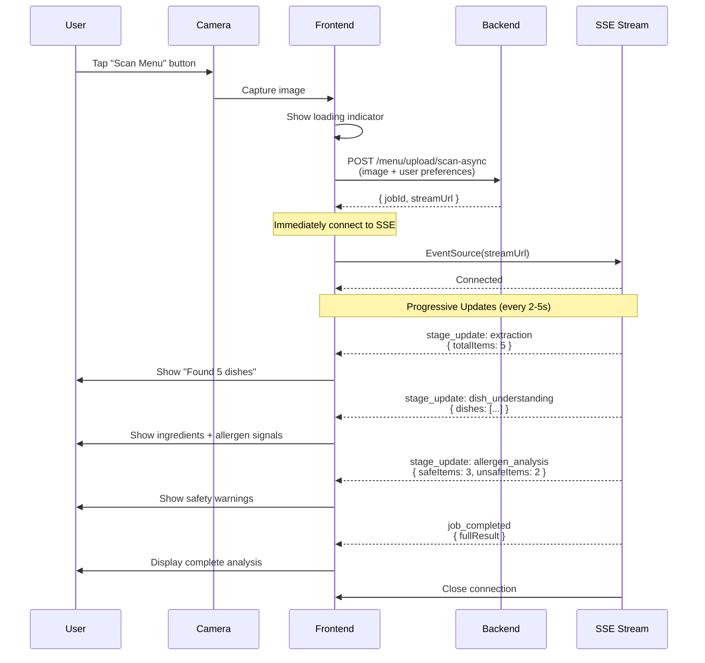

# Frontend Camera Integration Flow

## 📸 Camera → Menu Analysis → Results

### Overview
Complete flow from camera capture to displaying menu analysis results with progressive loading.

---

## 🎯 Flow Diagram



---

## 📱 Implementation Steps

### **Step 1: Camera Capture**
```typescript
// React Native / Expo Camera
import { Camera } from 'expo-camera';

const captureMenuPhoto = async () => {
  const photo = await cameraRef.current.takePictureAsync({
    quality: 0.8,
    base64: false,
  });
  
  uploadAndAnalyze(photo.uri);
};
```

### **Step 2: Upload to Async Endpoint**
```typescript
const uploadAndAnalyze = async (imageUri: string) => {
  const formData = new FormData();
  formData.append('image', {
    uri: imageUri,
    type: 'image/jpeg',
    name: 'menu.jpg',
  });
  
  // Add user preferences from profile
  formData.append('language', 'vi');
  formData.append('allergens', JSON.stringify([
    { type: 'shellfish', severity: 'severe' },
    { type: 'peanut', severity: 'moderate' },
  ]));
  formData.append('dietaryPreferences', JSON.stringify(['vegan']));

  // Upload and get jobId
  const response = await fetch('https://api.tastebuddy.ai/menu/upload/scan-async', {
    method: 'POST',
    body: formData,
    headers: {
      'Authorization': `Bearer ${accessToken}`,
    },
  });

  const { jobId, streamUrl } = await response.json();
  
  // Start listening to stream
  listenToStream(jobId, streamUrl);
};
```

### **Step 3: Listen to SSE Stream**
```typescript
const listenToStream = (jobId: string, streamUrl: string) => {
  const eventSource = new EventSource(
    `https://api.tastebuddy.ai${streamUrl}`,
    {
      headers: {
        'Authorization': `Bearer ${accessToken}`,
      },
    }
  );

  // Connected
  eventSource.addEventListener('message', (e) => {
    const event = JSON.parse(e.data);
    
    switch (event.type) {
      case 'stage_update':
        handleStageUpdate(event);
        break;
        
      case 'job_completed':
        handleJobCompleted(event);
        eventSource.close();
        break;
        
      case 'job_failed':
        handleJobFailed(event);
        eventSource.close();
        break;
    }
  });

  eventSource.onerror = (error) => {
    console.error('SSE Error:', error);
    // Fallback to polling
    startPolling(jobId);
  };
};
```

### **Step 4: Handle Progressive Updates**
```typescript
const handleStageUpdate = (event: any) => {
  const { stage, status, data } = event;
  
  switch (stage) {
    case 'extraction':
      if (status === 'completed') {
        // Show menu items immediately
        setMenuItems(data.totalItems);
        updateUI({ 
          message: `Tìm thấy ${data.totalItems} món ăn`,
          progress: 30 
        });
      }
      break;
      
    case 'dish_understanding':
      if (status === 'completed') {
        // Show ingredients and allergen signals
        setDishes(data.dishes);
        updateUI({ 
          message: `Đã phân tích ${data.totalDishes} món`,
          progress: 60 
        });
      }
      break;
      
    case 'allergen_analysis':
      if (status === 'completed') {
        // Show safety warnings
        setSafetyResults(data);
        updateUI({ 
          message: `${data.safeItems} món an toàn, ${data.unsafeItems} món có nguy cơ`,
          progress: 90 
        });
      }
      break;
  }
};
```

### **Step 5: Display Final Results**
```typescript
const handleJobCompleted = (event: any) => {
  const result = event.result;
  
  // Navigate to results screen
  navigation.navigate('MenuAnalysisResults', {
    extraction: result.data.extraction,
    allergenAnalysis: result.data.allergenAnalysis,
    dietaryCompliance: result.data.dietaryCompliance,
  });
  
  // Hide loading
  setLoading(false);
};
```

---

## 🔄 Polling Fallback (for browsers without SSE support)

```typescript
const startPolling = async (jobId: string) => {
  const pollInterval = setInterval(async () => {
    try {
      const response = await fetch(
        `https://api.tastebuddy.ai/menu/jobs/${jobId}`,
        {
          headers: {
            'Authorization': `Bearer ${accessToken}`,
          },
        }
      );
      
      const job = await response.json();
      
      // Update UI based on current stage
      if (job.status === 'completed') {
        handleJobCompleted({ result: job.result });
        clearInterval(pollInterval);
      } else if (job.status === 'failed') {
        handleJobFailed({ error: job.error });
        clearInterval(pollInterval);
      } else {
        // Update progress
        updateProgressFromStages(job.stages);
      }
    } catch (error) {
      console.error('Polling error:', error);
      clearInterval(pollInterval);
    }
  }, 2000); // Poll every 2 seconds
};
```

---

## 🎨 UI States

### 1. **Uploading** (0-1s)
```
📤 Đang tải ảnh lên...
[=====               ] 25%
```

### 2. **Extraction** (1-5s)
```
🔍 Đang trích xuất menu...
[==========          ] 50%
✅ Tìm thấy 5 món ăn
```

### 3. **Dish Understanding** (5-8s)
```
🍲 Đang phân tích món ăn...
[===============     ] 75%
✅ Đã phân tích 5 món
```

### 4. **Safety Analysis** (8-16s)
```
⚠️ Đang kiểm tra an toàn...
[=================== ] 95%
✅ 3 món an toàn, 2 món có nguy cơ
```

### 5. **Complete** (16s)
```
🎉 Hoàn tất!
[====================] 100%
Chuyển đến kết quả...
```

---

## 🚨 Error Handling

```typescript
const handleJobFailed = (event: any) => {
  const errorCode = event.error?.code || 'UNKNOWN_ERROR';
  
  const errorMessages = {
    'ERR_NOT_FOOD_IMAGE': 'Ảnh không phải là món ăn hoặc menu. Vui lòng chụp lại.',
    'ERR_FILE_TOO_LARGE': 'Ảnh quá lớn (> 10MB). Vui lòng chọn ảnh nhỏ hơn.',
    'ERR_CLOUD_VISION_FAILED': 'Lỗi OCR. Thử lại với ảnh rõ hơn.',
  };
  
  Alert.alert(
    'Lỗi phân tích',
    errorMessages[errorCode] || 'Đã có lỗi xảy ra. Vui lòng thử lại.',
    [
      { text: 'Chụp lại', onPress: () => openCamera() },
      { text: 'Hủy', style: 'cancel' },
    ]
  );
};
```

---

## 📊 Complete Example (React Native)

```typescript
import React, { useState, useRef } from 'react';
import { View, Button, Text, ActivityIndicator } from 'react-native';
import { Camera } from 'expo-camera';

export const MenuScannerScreen = () => {
  const [scanning, setScanning] = useState(false);
  const [progress, setProgress] = useState(0);
  const [message, setMessage] = useState('');
  const cameraRef = useRef<Camera>(null);

  const scanMenu = async () => {
    setScanning(true);
    
    // 1. Capture photo
    const photo = await cameraRef.current.takePictureAsync({
      quality: 0.8,
    });

    // 2. Upload
    const formData = new FormData();
    formData.append('image', {
      uri: photo.uri,
      type: 'image/jpeg',
      name: 'menu.jpg',
    });

    const response = await fetch('https://api.tastebuddy.ai/menu/upload/scan-async', {
      method: 'POST',
      body: formData,
    });

    const { jobId, streamUrl } = await response.json();

    // 3. Listen to SSE
    const eventSource = new EventSource(`https://api.tastebuddy.ai${streamUrl}`);

    eventSource.addEventListener('message', (e) => {
      const event = JSON.parse(e.data);

      if (event.type === 'stage_update') {
        const stageProgress = {
          'extraction': 30,
          'dish_understanding': 60,
          'allergen_analysis': 90,
        };
        
        setProgress(stageProgress[event.stage] || 0);
        setMessage(`Đang xử lý: ${event.stage}`);
      }

      if (event.type === 'job_completed') {
        setProgress(100);
        setMessage('Hoàn tất!');
        
        // Navigate to results
        navigation.navigate('Results', { data: event.result });
        
        eventSource.close();
        setScanning(false);
      }
    });
  };

  return (
    <View>
      <Camera ref={cameraRef} style={{ flex: 1 }} />
      
      {scanning ? (
        <View>
          <ActivityIndicator size="large" />
          <Text>{message}</Text>
          <Text>{progress}%</Text>
        </View>
      ) : (
        <Button title="Quét Menu" onPress={scanMenu} />
      )}
    </View>
  );
};
```

---

## ⏱️ Timeline Summary

| Stage | Time | Frontend Action |
|-------|------|----------------|
| **Upload** | 0-1s | Show loading |
| **Extraction** | 1-5s | Display "Found X dishes" |
| **Dish Understanding** | 5-8s | Show ingredients |
| **Safety Analysis** | 8-16s | Show allergen warnings |
| **Complete** | 16s | Navigate to results |

---

## 💡 Best Practices

1. **Always show progress**: Use SSE updates to show real-time progress
2. **Immediate feedback**: Show "Found X dishes" as soon as extraction completes
3. **Offline handling**: Cache results, retry failed uploads
4. **Error recovery**: Provide clear retry options
5. **User auth**: Include Bearer token in all requests

---

## 🔗 API Endpoints Used

- `POST /menu/upload/scan-async` - Upload and get jobId
- `GET /menu/jobs/:jobId/stream` (SSE) - Real-time updates
- `GET /menu/jobs/:jobId` - Polling fallback
